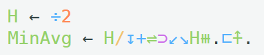
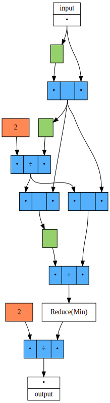

# Proof-of-concept: Dataflow graphs for Uiua
[Uiua](https://www.uiua.org/) is stack based array stack-based array-oriented programming language. This visualization tries to get rid of the stack shuffling operation and shows the underlying dataflow graph of a function.

# Demo
The `MinAvg` snippet results in the following graph.

